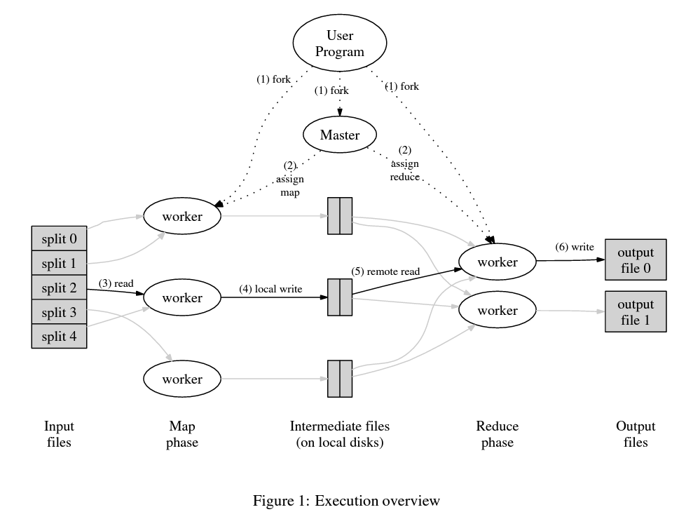

user调用mapreduce函数时，会发生如下动作：

1. 用户程序首先把输入文件划分为M份（每份16~64MB）
2. 有一个master，M个map任务和R个reduce任务，master选择workers来分配map和reduce任务
3. 负责map任务的worker会读取对应文件，然后进行单词划分统计，最后存储到对应文件中
4. 周期性的，map worker会把这些文件的位置告诉master，然后由master分配给reduce worker